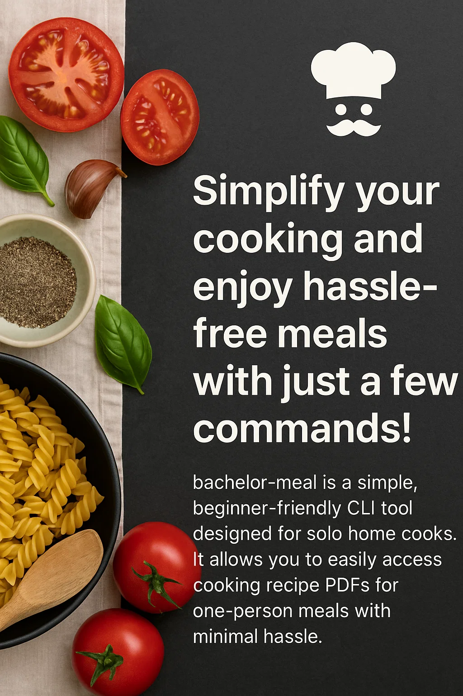

# `bachelor-meal` CLI Tool 🌟

<p align="center">
  
</p>

<h1 align="center">bachelor-meal</h1>

<p align="center">
  <strong>🍽️ Simplify your cooking and enjoy delicious, hassle-free meals with just a few commands! 🍳</strong>
</p>

<p align="center">
  <code>bachelor-meal</code> — A simple, beginner-friendly CLI tool designed for solo home cooks. It allows you to easily access cooking recipe PDFs for one-person meals with minimal hassle.
</p>

<p align="center">
<a href="https://www.npmjs.com/package/bachelor-meal" target="_blank" rel="noopener noreferrer">
  
</a>
<a href="https://github.com/sajjad-developer/bachelor-meal/actions/workflows/ci.yml" target="_blank" rel="noopener noreferrer">
  
</a>
<a href="https://github.com/sajjad-developer/bachelor-meal/blob/main/LICENSE" target="_blank" rel="noopener noreferrer">
  
</a>
<a href="https://github.com/sajjad-developer/bachelor-meal/issues?q=is%3Aissue+is%3Aopen+label%3A%22good+first+issue%22" target="_blank" rel="noopener noreferrer">
  
</a>
<a href="https://github.com/sajjad-developer/bachelor-meal/issues?q=is%3Aissue+is%3Aopen+label%3Ahelp-wanted" target="_blank" rel="noopener noreferrer">
  
</a>
<a href="https://packagephobia.com/result?p=bachelor-meal" target="_blank" rel="noopener noreferrer">
  
</a>
<!-- Add the npm downloads badge here -->
<a href="https://www.npmjs.com/package/bachelor-meal" target="_blank" rel="noopener noreferrer">
  
</a>
</p>

## Table of Contents

- [🔑 Features](#-features)
- [📦 Installation](#-installation)
  - [📝 Node.js and VS Code Setup (for non-programmers)](#step-1-install-nodejs)
  - [🌍 Global Installation](#option-1-global-installation)
  - [🚀 Run Directly Using npx](#option-2-run-directly-using-npx)
- [📋 Usage](#-usage)
- [📝 Commands](#-commands)
- [🤝 Contributing](#-contributing)
- [☕ Support My Work](#-support-my-work)
- [📄 License](#-license)

## 🔑 Features

- Quick access to one-person cooking recipes in PDF format.
- Recipes include:
  - **Rice Cooking Manual**
  - **Egg Frying Manual**
  - **One-Person Single-Day Lentil Cooking Recipe**
- Simple command-line interface (CLI) with easy-to-remember commands.

## 📦 Installation

**Note**: If you're already familiar with **VS Code** and **Node.js**, you can skip the following installation steps and jump straight to the [Global Installation](#option-1-global-installation) or [Run Directly Using npx](#option-2-run-directly-using-npx) section.

Before using the **Bachelor Meal CLI Tool**, you'll need to have **Node.js** and **VS Code** installed on your computer. Follow the instructions below to set everything up.

### Step 1: Install Node.js

1. Visit the [Node.js download page](https://nodejs.org/).
2. Download the version labeled **LTS** (Long-Term Support).
3. Run the installer and follow the prompts to complete the installation.

You can verify that Node.js is installed by opening your terminal and typing the following command:

```bash
node -v
```

If you see the version number, Node.js is installed correctly.

### Step 2: Install VS Code (Visual Studio Code)

1. Visit the [VS Code download page](https://code.visualstudio.com/).
2. Download and install the appropriate version for your operating system.
3. Open VS Code after installation.

### Step 3: Open Your Project in VS Code

1. Open **VS Code**.
2. Click on **File** > **Open Folder...**.
3. Select the folder where you saved the **Bachelor Meal** project and click **Open**.

### Option 1: Global Installation

To install the Bachelor Meal CLI tool globally, run the following command in your terminal:

```bash
npm install -g bachelor-meal
```

### Option 2: Run Directly Using `npx`

Alternatively, you can run the tool directly using `npx` without installing it globally:

```bash
npx bachelor-meal <command>
```

## 📋 Usage

After installing, you can use the tool directly from the command line. Running `bachelor-meal` without any arguments will display the following usage instructions:

```bash
$ bachelor-meal
Usage: bachelor-meal [options] [command]

Options:
  -h, --help      display help for command

Commands:
  rice            Open the Rice Cooking Manual PDF
  egg             Open the Egg Cooking Manual PDF
  lentil          Open the Lentil Cooking Manual PDF
  help [command]  display help for command
```

You can also use the following commands to open the corresponding recipe PDF:

- `bachelor-meal rice`: Opens the **Rice Cooking Manual PDF**
- `bachelor-meal egg`: Opens the **Egg Frying Manual PDF**
- `bachelor-meal lentil`: Opens the **One-Person Single-Day Lentil Cooking Recipe PDF**

For example, to open the Rice Cooking Manual:

```bash
bachelor-meal rice
```

The corresponding PDF will automatically open on your system.

## 📝 Commands

- `bachelor-meal rice` – Opens the Rice Cooking Manual PDF
- `bachelor-meal egg` – Opens the Egg Frying Manual PDF
- `bachelor-meal lentil` – Opens the One-Person Single-Day Lentil Cooking Recipe PDF

## 🤝 Contributing

We welcome your contributions! Whether you're fixing bugs, suggesting new features, or improving documentation, your help is appreciated.

For detailed instructions on how to contribute to the project, please read the [CONTRIBUTING.md](./CONTRIBUTING.md) file.

If you encounter any bugs or have suggestions for improvements, please create an issue on GitHub.

> 💡 All contributions are voluntary.
> **Financial tips are a personal gesture to the maintainer and are not shared with contributors.**

## ☕ Support My Work

✨ This project is developed and maintained by me during my personal time.  
If **bachelor-meal** has saved you time or improved your workflow, please consider leaving a **voluntary tip** to support ongoing development:

[](https://eco-starfish-coder.com/tip)

> ⚠️ **Note:** Tips are optional and go directly to the maintainer (me).  
> This project is open-source and free to use. Contributions are welcome, but not financially compensated.

## 📄 License

This project is licensed under the MIT License - see the [LICENSE](LICENSE) file for details.
